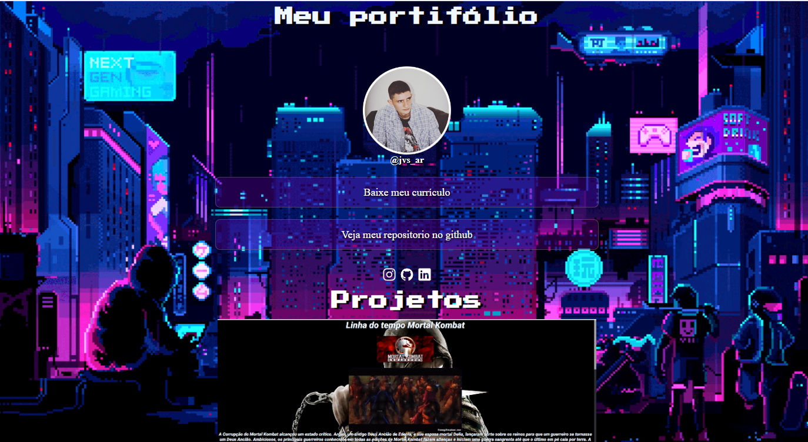

## 🖥️ Projeto
Esse é um projeto responsivo de um portifólio, a onde tem algumas informações sobre mim e meus projetos.

## 🛸 Tecnologia
Projeto desenvolvido por mim para aprimorar meus conhecimetos,utilizando as seguinte tecnologias:
- HTML
- CSS
- Git e Github
